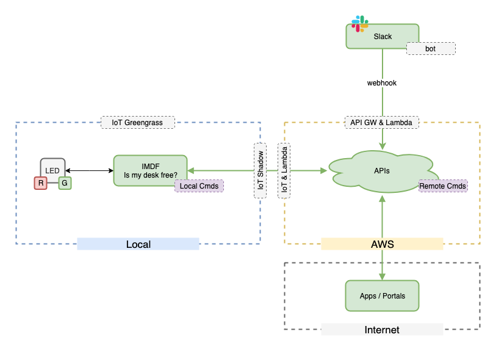
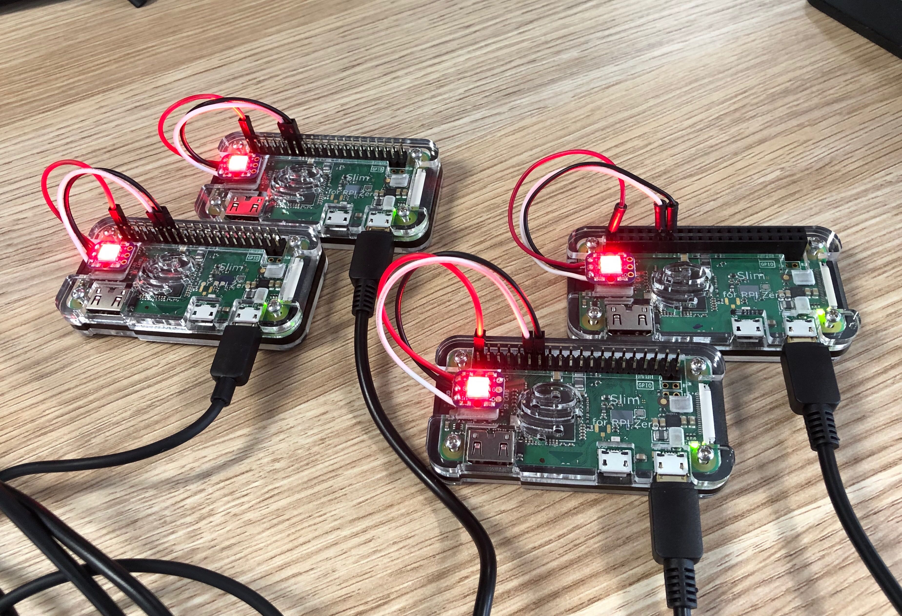

# IMDF Prototype

Project: Is My Desk Free?

## Context Overview



## Setup

### WiFi Setup

```SHELL
sudo su -
wpa_passphrase '<WIFI_SSID>' '<WIFI_PRESHARE_KEY>' >> /etc/wpa_supplicant/wpa_supplicant.conf
init 6
```

### Install IMDF dependencies

```SHELL
cd ~/imdf/iot-client
npm i
```

### Install python library to light led

```SHELL
# sudo pip3 install adafruit-circuitpython-lis3dh
sudo pip3 install rpi_ws281x adafruit-circuitpython-neopixel
```

### Install pm2 globally

```SHELL
npm install pm2 -g
```

### Start IMDF using pm2

```SHELL
cd ~/imdf/iot-client
pm2 --name "imdf" start npm -- start
```

### Setup system startup hook

```SHELL
pm2 startup
```

### Follow instruction prompt and save config

```SHELL
sudo su -c "env PATH=$PATH:/home/unitech/.nvm/versions/node/v4.3/bin pm2 startup <distribution> -u <user> --hp <home-path>
pm2 save
```

### Monitor processes managed by pm2

```SHELL
pm2 monit
```

### Prototypes


