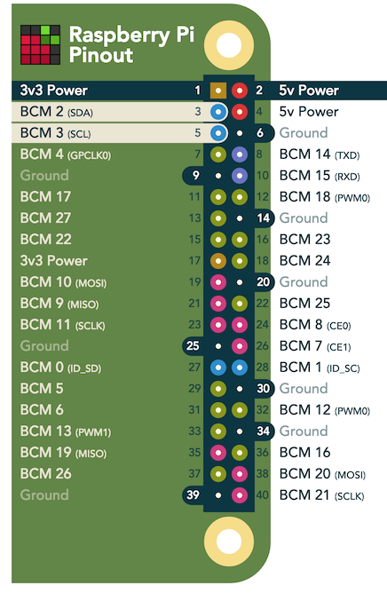
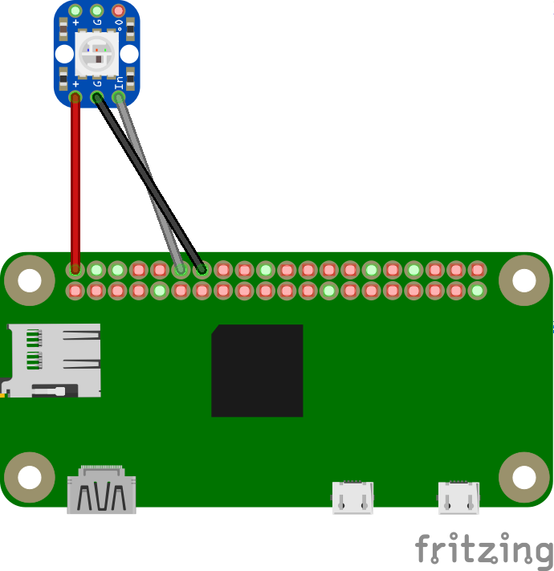

# IMDF Prototype

Project: Is My Desk Free?

## Context Overview


## Setup

### image installation

install image `Raspbian Stretch Lite` to sd card, following the instruction (default user is pi, password is raspberry)

https://www.raspberrypi.org/documentation/installation/installing-images/README.md


### Setup

run `sudo raspi-config` to enable ssh, change timezone, change locale and change keyboard setting

```SHELL
sudo su -
wpa_passphrase '<WIFI_SSID>' '<WIFI_PRESHARE_KEY>' >> /etc/wpa_supplicant/wpa_supplicant.conf
init 6
```

https://www.raspberrypi.org/documentation/configuration/wireless/wireless-cli.md

## install general dependencies and setup

```SHELL
sudo apt-get update
sudo apt-get install git python3-pip -y
# install nodejs and npm
curl -o node-v9.9.0-linux-armv6l.tar.gz https://nodejs.org/dist/v9.9.0/node-v9.9.0-linux-armv6l.tar.gz
tar -xzf node-v9.9.0-linux-armv6l.tar.gz
sudo cp -r node-v9.9.0-linux-armv6l/* /usr/local/
node -v
npm -v
git clone https://github.com/jovi-wang/imdf.git
```


### Install IMDF dependencies

```SHELL
cd ~/imdf/iot-client
npm i
# copy certificates using scp command
nano config.js
# change deviceId and certificatePrefix
```

### Install python library to light led

```SHELL
# sudo pip3 install adafruit-circuitpython-lis3dh
sudo pip3 install rpi_ws281x adafruit-circuitpython-neopixel
```

### Install pm2 globally

```SHELL
sudo npm install pm2 -g
```

### Start IMDF using pm2

```SHELL
cd ~/imdf/iot-client
pm2 --watch --name "imdf" start npm -- start
```

### Setup system startup hook

```SHELL
pm2 startup
```

### Follow instruction prompt and save config

```SHELL
sudo su -c "env PATH=$PATH:/home/unitech/.nvm/versions/node/v4.3/bin pm2 startup <distribution> -u <user> --hp <home-path>
pm2 save
```

### Monitor processes managed by pm2

```SHELL
pm2 monit
```

ps: user's name in the channel and  deviceId in iot-client's config.js should be identical. need to match lambda's env variables

## Hardware

### Pinout



### Wiring


